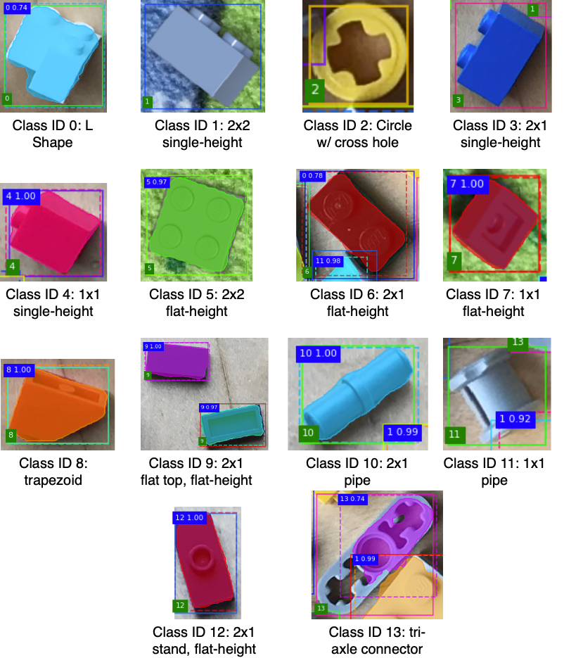

## Using HEIC Images

Download and install ImageMagick and then use [Wand](https://docs.wand-py.org/en/0.6.4/). Make sure the pip install takes place in the conda environment if you are using one. 

``` zsh
brew install imagemagick
pip install Wand
```

Run the `heic_to_png.py` script as follows to convert a folder of your own iPhone photos (file format HEIC) to pngs.

``` zsh
python heic_to_png.py SOURCE DEST
```

## Resizing and Cropping

Need to install the following package in order to be able to use the opencv imshow function with a conda environment ([reference](https://stackoverflow.com/questions/64838511/opencv-imshow-crashes-python-launcher-on-macos-11-0-1-big-sur)).

``` zsh
pip install opencv-python-headless
```

iPhone images are taken with a size 3024 x 4032 which is a 3:4 aspect ratio. The training images have a ratio of 4:3 and a size 800 x 600. The `prepare_img.py` script converts a folder of pngs in the original iPhone dimensions to 800 x 600. OpenCV is used to resize the image. Before resizing, the images are transposed (reflected across the top-left to bottom-right diagonal).

``` zsh
python prepare_img.py PNG_FOLDER
```

## Generate Annotations

We can generate annotations using the [VGG Image Annotator](https://www.robots.ox.ac.uk/~vgg/software/via/). When assigning the region attributes, their needs to be a *class_id* attribute set for every lego. The id actually corresponds to the class name which can be found using the mapping below. Annotations can be exported in .json. Note that the annotation format changes (regions goes from a dictionary to a list) between version 1.x and 2.x.

